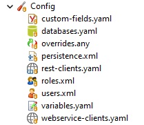
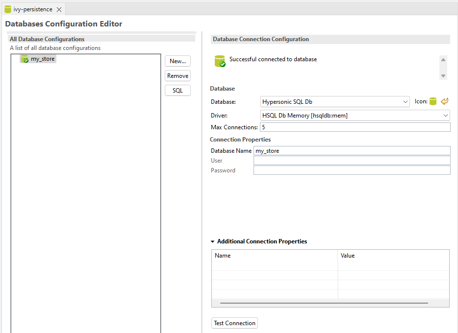
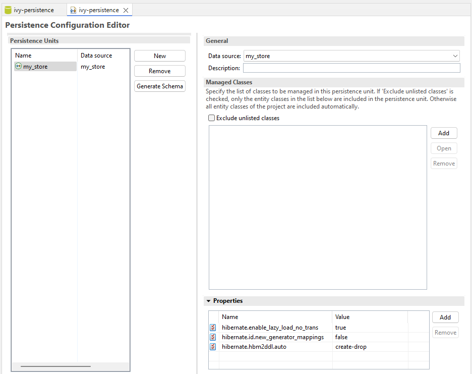
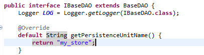
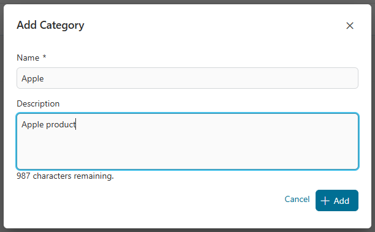
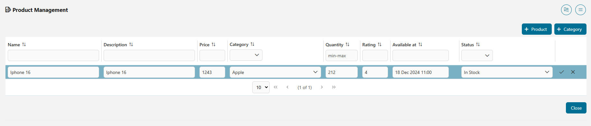

# Persistence Utils Example

## 1. Create database connection from `Config/databases.yaml` ##

## 2. Create persistence units from `Config/databases.yaml` ##

>[!IMPORTANT]
> We need to define the persistence name in `getPersistenceUnitName()` function
>

## Demo ##

