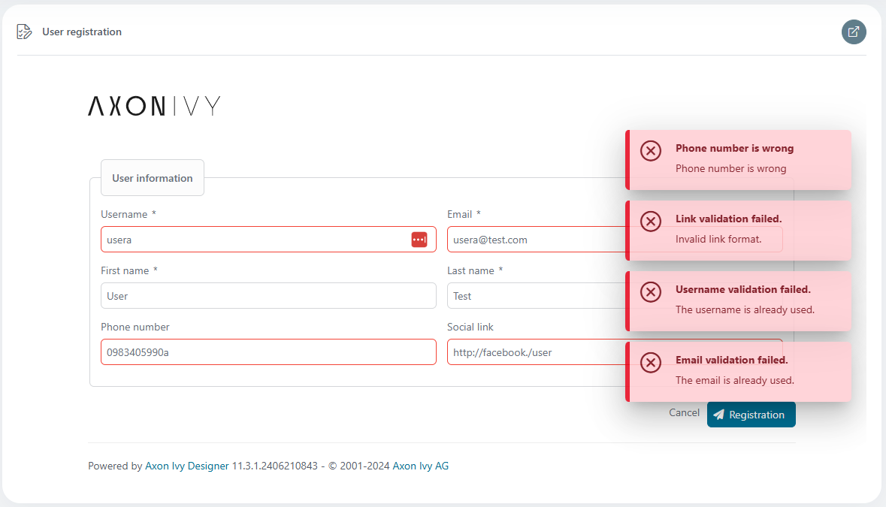

## How to validation in JSF and Ivy platform ?

There are some validations in JSF which we can apply.

**1. The "required" attribute of tag**

Using the jsf tag's attribute like `required`, `validator` and `requiredMessage`, `validatorMessage` to validate and show the expected message

```html
<p:inputText id="firstName" required="true" requiredMessage="First name is required" value="#{...}" />
  
<p:inputText id="phoneNumber" validator="#{data.bean.onValidationPhoneNumber}" validatorMessage="Phone number is wrong" value="#{...}" />
```
  
**2. JSF - Validator Tags**

Using the jsf tags like `f:validate...` and `validatorMessage` to validate and show the expected message
Check out the document [link](https://www.tutorialspoint.com/jsf/jsf_validation_tags.htm)!
```html
<p:inputText id="email" validatorMessage="Email is wrong format" value="#{...}" >
	<f:validateRegex pattern="^[_A-Za-z0-9-\+]+(\.[_A-Za-z0-9-]+)*@[A-Za-z0-9-]+(\.[A-Za-z0-9]+)*(\.[A-Za-z]{2,})$" />
</p:inputText>

<p:inputText id="socialUrl" value="#{...}">
	<f:validator validatorId="com.examples.ivy.LinkValidator" />
</p:inputText>
```

**3. Validation in PostValidateEvent**

The javax.faces.event.PostValidateEvent is a system event, that fire after all components are validated. The idea is register a PostValidateEvent, and attach to a validation method.

```html
<h:form id="form">
	<p:growl id="messages" skipDetailIfEqualsSummary="true" />
	<f:event listener="#{data.bean.onValidationUserInformation}" type="postValidate" />
	...
</h:form>	
```

The result:
 
 